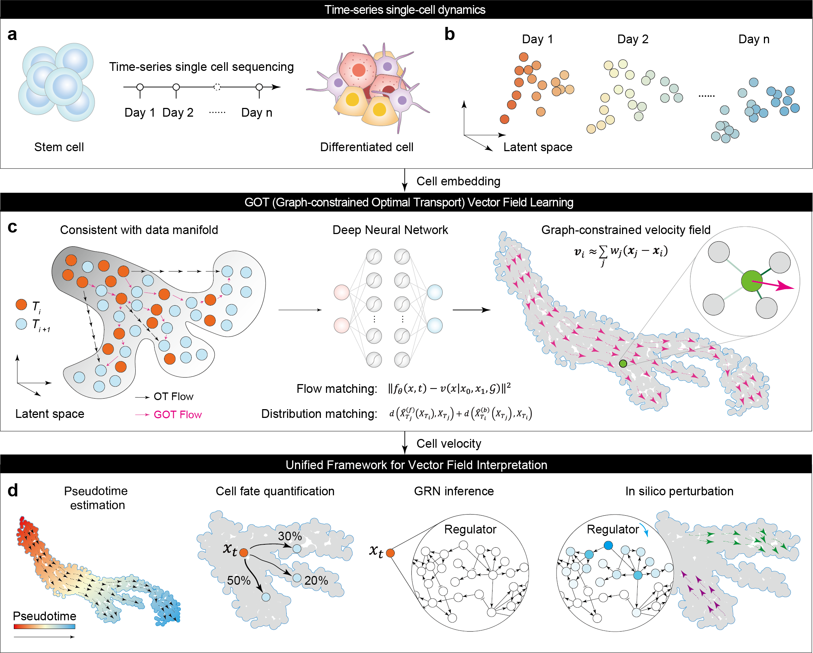

# GOT (Graph constrained Optimal Transport): Deciphering Cellular Dynamics by Learning and Interpreting Vector Field

**pyGOT** is a Python package designed to help biologists analyze cellular dynamics by learning and interpreting vector fields from single-cell data.

[](https://witiy.github.io/GOT/)

> 📘 **Documentation:** [https://witiy.github.io/GOT/](https://witiy.github.io/GOT/)

<p align="center">
  
</p>

---

## 🚀 Installation

### From PyPI

```bash
conda create -n pyGOT python=3.10
pip install py-scgot
```

### From GitHub

```bash
git clone git@github.com:Witiy/GOT.git
cd GOT
conda create -n GOT python=3.10
pip install .
```

---

## 🧭 Tutorials

Please visit the [online documentation](https://witiy.github.io/GOT/) for full tutorials:

- Vector Field Learning (Time-series / Snapshot)
- Velocity-based Pseudotime
- Cell Fate Prediction
- Developmental Tree Inference
- Gene Regulatory Network Inference
- In silico Perturbation


---

## 📦 Reproducibility

For full analysis workflows, datasets, and reproduction of the main figures, please visit the reproducibility repository:

👉 [https://github.com/Witiy/GOT_reproducibility](https://github.com/Witiy/GOT_reproducibility)

---

## ⚡ Quick Start

### Vector Field Learning

#### Time-Series

```python
import pygot
import torch
import scvelo as scv

embedding_key = 'X_pca'
velocity_key = 'velocity_pca'
time_key = 'Day'  # your experimental time label

model, history = pygot.tl.fit_velocity_model(
    adata, embedding_key=embedding_key, time_key=time_key
)

pygot.tl.velocity(adata, model, embedding_key=embedding_key, time_key=time_key)
pygot.tl.velocity_graph(adata, embedding_key=embedding_key, velocity_key=velocity_key)
scv.pl.velocity_embedding_stream(adata)
```

#### Snapshot

```python
import pygot
import scvelo as scv

embedding_key = 'X_pca'
velocity_key = 'velocity_pca'

model, history = pygot.tl.traj.fit_velocity_model_without_time(
    adata, embedding_key, plot=True, basis='tsne',
    single_branch_detect=True, cell_type_key=cell_type_key
)

adata.layers['velocity'] = pygot.tl.traj.velocity(
    adata, model, embedding_key=embedding_key
)
pygot.tl.traj.velocity_graph(adata, embedding_key=embedding_key, velocity_key=velocity_key)

scv.pl.velocity_embedding_stream(adata)
```

---

### Vector Field Interpretation

#### Velocity-based Pseudotime

```python
pm = pygot.tl.analysis.ProbabilityModel()
history = pm.fit(adata, embedding_key=embedding_key, velocity_key=velocity_key)

adata.obs['pseudotime'] = pm.estimate_pseudotime(adata)
```

#### Cell Fate Prediction

```python
cf = pygot.tl.analysis.CellFate()
cf.fit(
    adata, embedding_key='X_pca', velocity_key='velocity_pca',
    cell_type_key='clusters', target_cell_types=['Beta', 'Alpha', 'Delta', 'Epsilon']
)
adata.obs[adata.obsm['descendant'].columns] = adata.obsm['descendant']
sc.pl.umap(adata, color=adata.obsm['descendant'].columns, ncols=2)
```

#### Developmental Tree Inference

```python
roadmap = pygot.tl.analysis.TimeSeriesRoadmap(adata, embedding_key, velocity_key, time_key)
roadmap.fit(cell_type_key='clusters', n_neighbors=30)

filtered_state_coupling_list = roadmap.filter_state_coupling(pvalue=0.001)
```

#### Gene Regulatory Network Inference

```python
grn = GRN()
grn_adata = grn.fit(adata, species='human')
print(grn_adata.ranked_edges.head())
```

#### In silico Perturbation

```python
import celloracle as co
oracle = co.Oracle()
oracle.import_anndata_as_normalized_count(
    adata, cluster_column_name=cell_type_key, embedding_name='X_umap'
)
grn.export_grn_into_celloracle(oracle)
```

