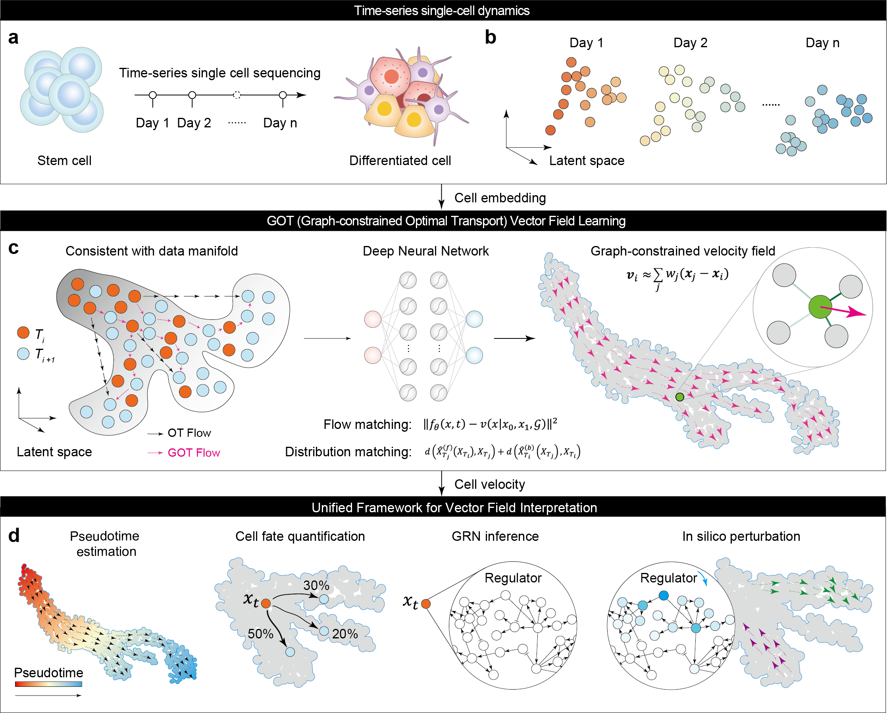

.. pygot documentation master file, created by
   sphinx-quickstart on Wed Aug 28 21:16:52 2024.
   You can adapt this file completely to your liking, but it should at least
   contain the root `toctree` directive
===================
GOT documentation
===================

GOT: Deciphering Cellular Dynamics by Learning and Interpreting Vector Field \

pyGOT is a python package help biologist to analyze the dynamics of cell.  

Installation
=============
Installation with pip
-----------------------
To install with pip, run the following from a terminal:

.. code-block:: python

   conda create -n pyGOT python==3.10
   pip install py-scgot

Installation from GitHub
--------------------------
To clone the repository and install manually, run the following from a terminal:

.. code-block:: python

   git clone git@github.com:Witiy/GOT.git
   cd GOT
   conda create -n GOT python==3.10
   pip install .

Quick Start
==========

This package consists of two main functional components. The first focuses on vector field learning. The second involves analyzing cellular dynamics by interpreting the learned vector field.

Vector Field Learning
---------------------

Time-Series
~~~~~~~~~~~

.. code-block:: python

   import pygot
   import torch
   import scvelo as scv

   embedding_key = 'X_pca'
   velocity_key = 'velocity_pca'
   time_key = 'Day'  # your experimental time label
   model, history = pygot.tl.traj.fit_velocity_model(
       adata, embedding_key=embedding_key, time_key=time_key
   )

   pygot.tl.traj.velocity(adata, model, embedding_key=embedding_key, time_key=time_key)
   pygot.tl.traj.velocity_graph(adata, embedding_key=embedding_key, velocity_key=velocity_key)
   scv.pl.velocity_embedding_stream(adata)

Snapshot
~~~~~~~~

.. code-block:: python

   import pygot
   import scvelo as scv

   embedding_key = 'X_pca'
   velocity_key = 'velocity_pca'
   model, history = pygot.tl.traj.fit_velocity_model_without_time(
       adata, embedding_key, plot=True, basis='tsne',
       single_branch_detect=True, cell_type_key=cell_type_key
   )

   adata.layers['velocity'] = pygot.tl.traj.velocity(
       adata, model, embedding_key=embedding_key
   )
   pygot.tl.traj.velocity_graph(adata, embedding_key=embedding_key, velocity_key=velocity_key)

   scv.pl.velocity_embedding_stream(adata)

Vector Field Interpretation
---------------------------

Velocity-based Pseudotime
~~~~~~~~~~~~~~~~~~~~~~~~~

.. code-block:: python

   # Fit the probability model
   pm = pygot.tl.analysis.ProbabilityModel()
   history = pm.fit(adata, embedding_key=embedding_key, velocity_key=velocity_key)

   # Estimated pseudotime of cells
   adata.obs['pseudotime'] = pm.estimate_pseudotime(adata)  # pseudotime

Cell Fate Prediction
~~~~~~~~~~~~~~~~~~~~

.. code-block:: python

   cf = pygot.tl.analysis.CellFate()
   cf.fit(
       adata, embedding_key='X_pca', velocity_key='velocity_pca',
       cell_type_key='clusters', target_cell_types=['Beta', 'Alpha', 'Delta', 'Epsilon']
   )
   adata.obs[adata.obsm['descendant'].columns] = adata.obsm['descendant']
   sc.pl.umap(adata, color=adata.obsm['descendant'].columns, ncols=2)

Developmental Tree Inference
~~~~~~~~~~~~~~~~~~~~~~~~~~~~

.. code-block:: python

   roadmap = pygot.tl.analysis.TimeSeriesRoadmap(adata, embedding_key, velocity_key, time_key)
   roadmap.fit(cell_type_key='clusters', n_neighbors=30)

   filtered_state_coupling_list = roadmap.filter_state_coupling(pvalue=0.001)  # permutation test

Gene Regulatory Network Inference
~~~~~~~~~~~~~~~~~~~~~~~~~~~~~~~~~

.. code-block:: python

   grn = GRN()
   grn_adata = grn.fit(adata, species='human')
   print(grn_adata.ranked_edges.head())  # print the top regulatory relationship

In silico Perturbation (after GRN inference)
~~~~~~~~~~~~~~~~~~~~~~~~~~~~~~~~~~~~~~~~~~~~

.. code-block:: python

   import celloracle as co
   oracle = co.Oracle()
   oracle.import_anndata_as_normalized_count(
       adata, cluster_column_name=cell_type_key, embedding_name='X_umap'
   )
   # Export to celloracle
   grn.export_grn_into_celloracle(oracle)

.. toctree::
   :caption: Main
   :maxdepth: 3
   :hidden:

   install
   api

   

.. toctree::
   :caption: Vector Field Learning
   :maxdepth: 1
   :hidden:

   [tutorial]01_vector_field_learning_for_time-series
   [tutorial]02_vector_field_learning_for_snapshot

.. toctree::
   :caption: Vector Field Interpretation
   :maxdepth: 1
   :hidden:

   [tutorial]03_velocity_based_pseudotime
   [tutorial]04_cell_fate_prediction
   [tutorial]05_development_tree_inference
   [tutorial]06_gene_regulatory_network_inference
   [tutorial]07_in_silico_perturbation
   

